# NetworkSecurity MLOps — Complete Mermaid Diagrams

---

## DIAGRAM 1: High-Level Pipeline Overview

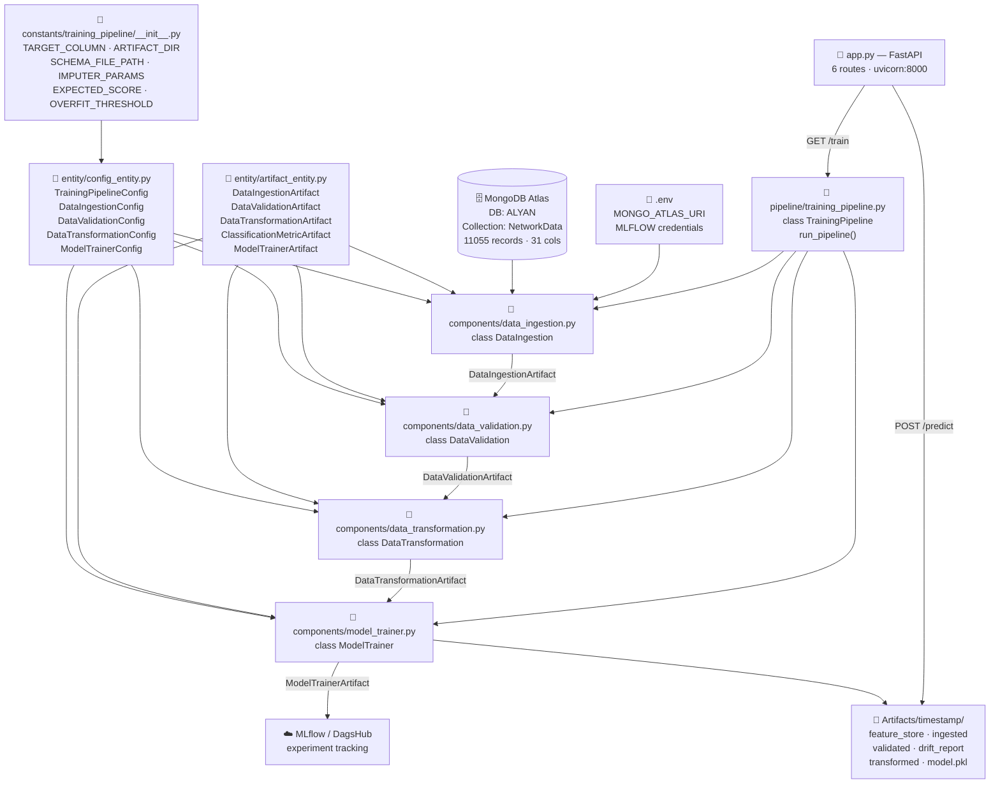

---

## DIAGRAM 2: Data Ingestion — Detailed

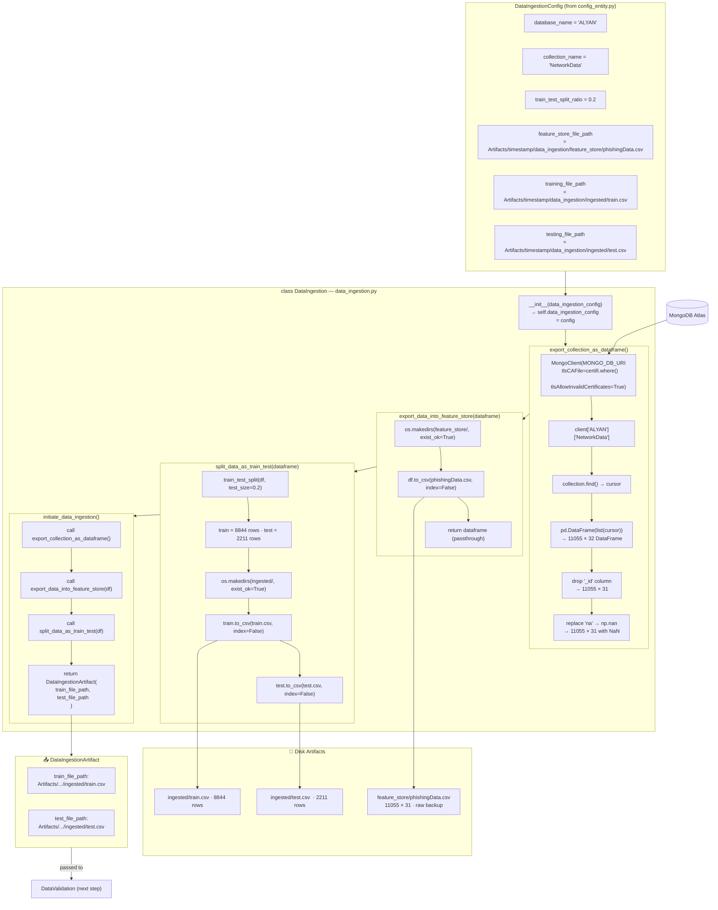

---

## DIAGRAM 3: Data Validation — Detailed

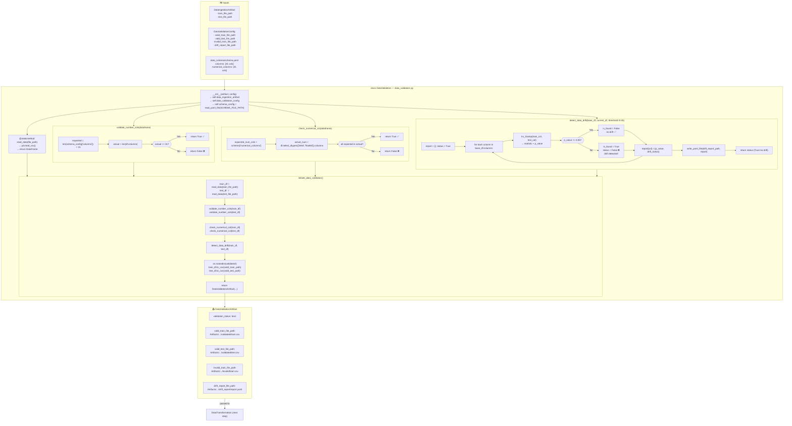

---

## DIAGRAM 4: Data Transformation — Detailed

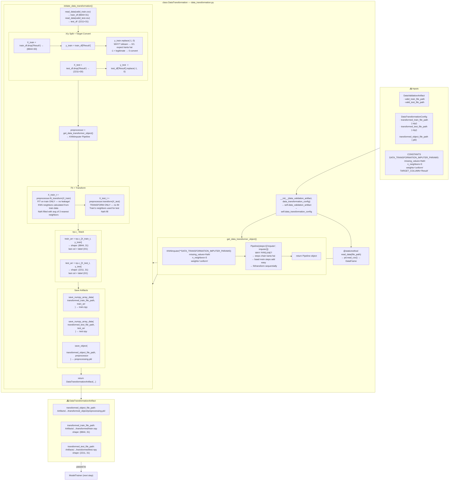

---

## DIAGRAM 5: Model Trainer — Detailed

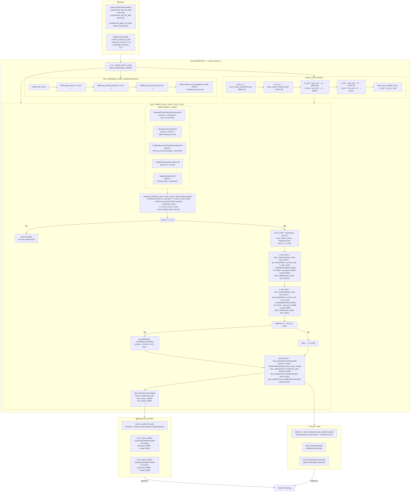

---

## DIAGRAM 6: FastAPI — Routes & Prediction Flow

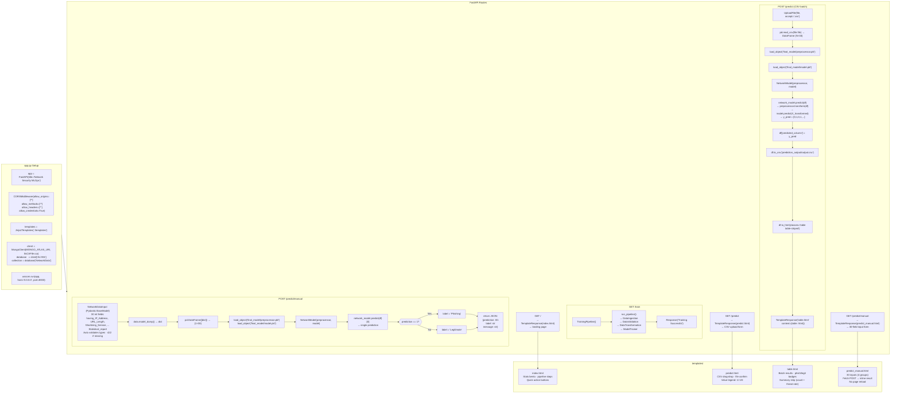

---

## DIAGRAM 7: Training Pipeline Orchestrator

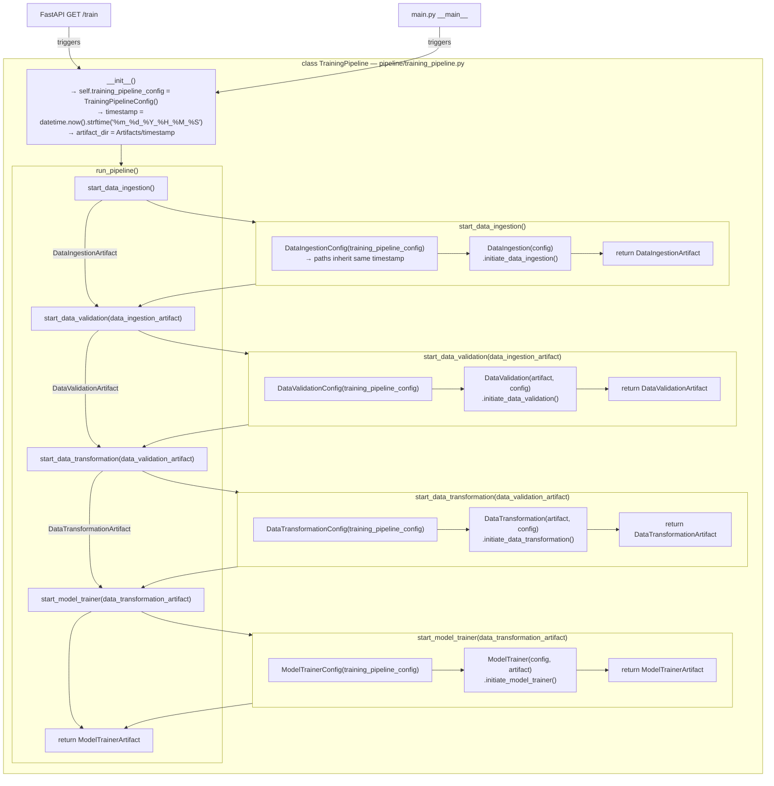

---

## DIAGRAM 8: NetworkModel + Prediction Chain

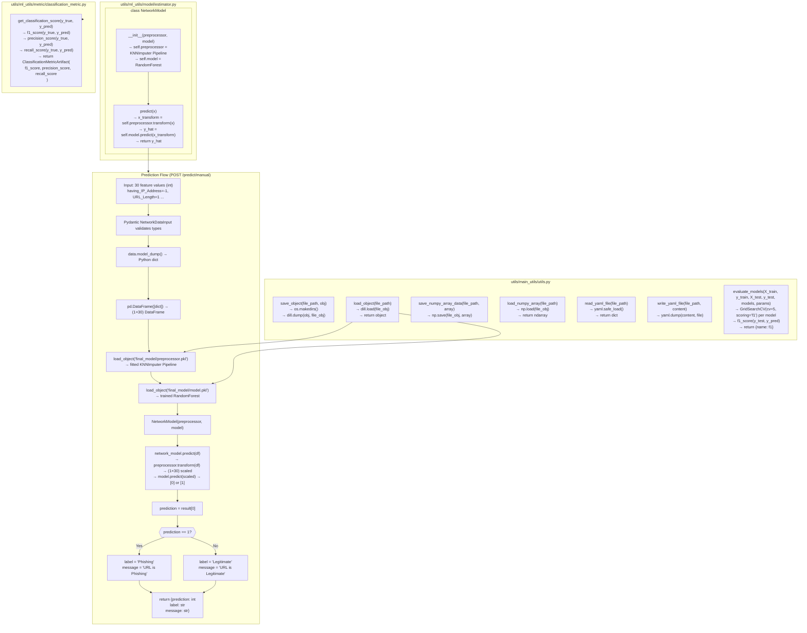

---

## DIAGRAM 9: Data Shape Transformation Through Pipeline

```mermaid
flowchart LR
    subgraph MONGO["MongoDB"]
        D0["11055 documents\neach: {feature1: 1, feature2: -1, ...\n_id: ObjectId, Result: 1}"]
    end

    subgraph DI_SHAPE["After DataIngestion"]
        D1["DataFrame\n(11055, 32) ← with _id\n(11055, 31) ← after drop\nCSV: train (8844×31)\n     test  (2211×31)"]
    end

    subgraph DV_SHAPE["After DataValidation"]
        D2["Same shape — validated\ntrain (8844, 31)\ntest  (2211, 31)\nAll 31 cols confirmed\nNo drift detected"]
    end

    subgraph DT_SHAPE["After DataTransformation"]
        D3["X_train: (8844, 30) features\ny_train: (8844,)   labels 0/1\nKNNImputer fills NaN\nnp.c_ → train_arr (8844, 31)\n         test_arr  (2211, 31)\nSaved as .npy binary"]
    end

    subgraph MT_SHAPE["ModelTrainer Input"]
        D4["train_arr[:, :-1] → X_train (8844, 30)\ntrain_arr[:, -1]  → y_train (8844,)\ntest_arr[:, :-1]  → X_test  (2211, 30)\ntest_arr[:, -1]   → y_test  (2211,)"]
    end

    subgraph PRED_SHAPE["Prediction Input"]
        D5["batch:  N × 30 DataFrame\nmanual: 1 × 30 DataFrame\n→ preprocessor.transform() → scaled\n→ model.predict() → [0,1,0...]"]
    end

    MONGO -->|collection.find() + pd.DataFrame| DI_SHAPE
    DI_SHAPE -->|validated/ CSVs| DV_SHAPE
    DV_SHAPE -->|fit_transform + np.c_| DT_SHAPE
    DT_SHAPE -->|load_numpy_array| MT_SHAPE
    MT_SHAPE -->|NetworkModel.predict| PRED_SHAPE
```

---

## DIAGRAM 10: Config Entity Dependency Tree

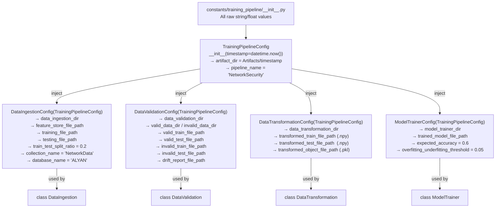

---

## DIAGRAM 11: Artifact Entity Chain

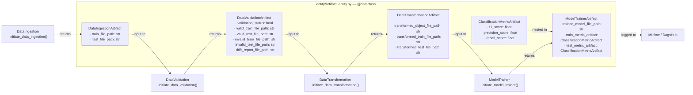

---

## DIAGRAM 12: MLflow Tracking Flow

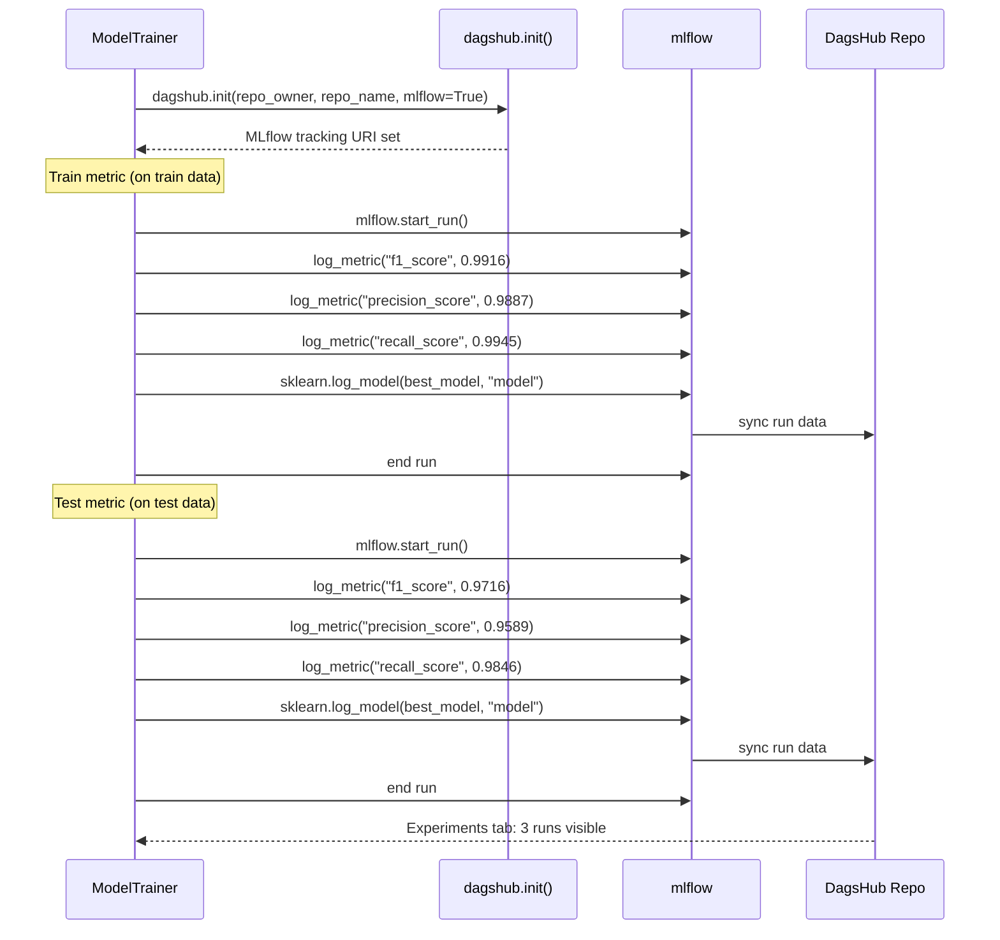

---

## DIAGRAM 13: KS Drift Detection Logic

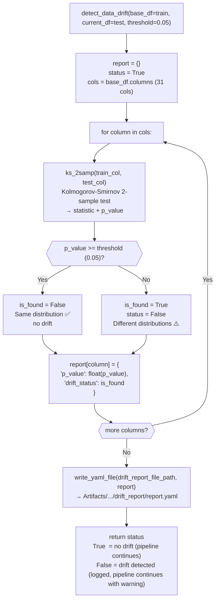